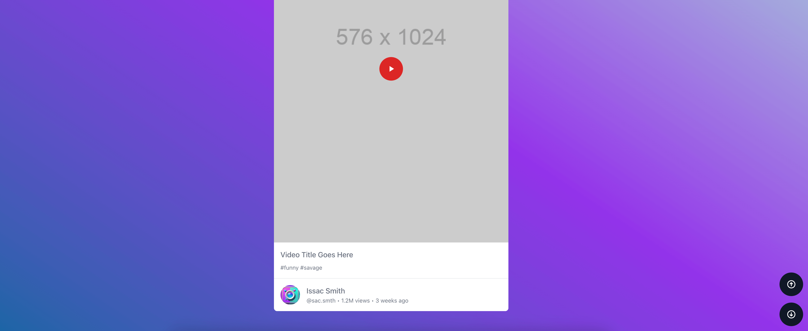

# Uploading a file to IPFS

## Under development

1. A youtube-shorts like video player based on IPFS.
2. Use smart contracts to store the video metadata on the blockchain.
3. Wagmi.sh hooks to interact with the smart contracts.
4. Rainbowkit to connect to the wallet.

# Built with
1. [Vite](https://vite.org/)
2. [React](https://reactjs.org/)
3. [TypeScript](https://www.typescriptlang.org/)
4. [TailwindCSS](https://tailwindcss.com/)
5. [Wagmi](https://wagmi.sh/)
6. [Rainbowkit](https://www.rainbowkit.com/)